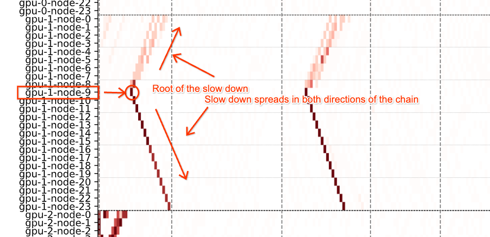

# Cluster Health Scanner

## 1. Introduction

The **Cluster Health Scanner** tool or simply **CHS** runs a series of tests
called _health checks_ to analyze the health of a cluster of GPU nodes.

For instructions on how to run CHS, go directly to the
['Running CHS' section](#3-running-chs).

While currently structured for Google Kubernetes Engine (GKE), CHS can
theoretically run on clusters using other Kubernetes orchestration
implementations.
There are plans to enable CHS to run on additional cluster orchestrators, such
as [Slurm](https://slurm.schedmd.com/overview.html) for HPC.


## 2. Architecture

The CHS structure runs with the concept of a 'Health Runner' that controls the
scheduling, launching, and post-processing of individual health checks that run
on the nodes in the cluster.


### 2.1 Repo Folder Structure

This repository is structured to separate running/deploying CHS and
building CHS.

#### Deploying CHS

The **[`deploy/`](deploy/)** directory contains the code to deploy CHS on a
cluster.
This is currently done for GKE clusters using [Helm](https://helm.sh/). If
you're looking to quickly start using CHS on your cluster, you only need to
install the Health Runner Helm chart, which contains all the health checks
included in CHS.
See the [section below](#3-running-chs) for details on running CHS.


#### Building CHS

The **[`src/`](src/)** directory contains the code that is run as part of the
Health Runner & health checks.

***This is not necessary to run CHS.*** Instead the code in `src/` is provided
for those wanting to build CHS directly.
See the [section below](#4-building-chs-from-src) for more details.


The **[`docker/`](docker/)** directory contains the Dockerfiles that can be
used with `src/` to build your own Docker images for CHS.
***This is not necessary to run CHS.*** However, certain users might find it
useful to customize their version of CHS.


### 2.2 CHS Design

CHS is broken up into the following parts:
- Health Runner
  * Manages how the health checks are launched on the nodes and then later
  cleaned up after completion
- Health Checks
  * Kicked off by the Health Runner and run on the nodes in the cluster to
  report their results to reflect the health of the node(s)/cluster

A user is able to configure the Health Runner to run particular health checks.
This configuration includes settings for how the Health Runner will run as well
as settings for the given health checks that will be run on nodes.

#### Health Runner

The Health Runner coordinates how and what health checks get launched on what
nodes.

The user configures the Health Runner to specify:

- Which health checks to run
- Settings/configuration of those health checks
- Other features of the Health Runner launching health checks such as
  how many health checks should run in parallel,
  what Docker image to use for the health check,
  and how often to launch health checks on the appropriate nodes.


#### Health Checks

Health checks can run on single or multiple nodes.
As health checks complete, results are reported
by node labels.

These health checks are all launched by the Health Runner & are set by the
Health Runner's configuration.

##### NCCL Health Check

Runs on two nodes to check networking across these nodes.
A 'pass' is given to both nodes when they have an average bandwidth that meets
or exceeds a given threshold.
Second-pass is enabled by default which runs the NCCL test for pairs of a
healthy and unhealthy node after a first test.
This helps reduce the number of false positives when only one node in a pair
is unhealthy.

The NCCL health check will pair nodes based on the parameter `PAIRING_MODE` in
the health runner configuration.

By default, NCCL health check runs in `random` pairing mode which runs the
health checks between random pairs of nodes. These are the supported topological
aware pairing modes:

###### Random Pairs (default)

> Checks ***ALL*** nodes (marked to be tested) by running NCCL tests between
> exhaustive random pairings of nodes.
> (Topology is not considered.)

To set:
`PAIRING_MODE: random`

Notes:
- Ignores topology of cluster and randomly pairs nodes together
- When second pass is enabled (`SECOND_PASS_ENABLED: true`), a NCCL test
  failure will proceed with another random pairing but this time using one
  passed node and one failed node in each pair.

###### Intra Rack

> Checks ***ALL*** nodes (marked to be tested) by running NCCL tests between
> exhaustive random pairings of nodes that are in the same rack.

To set:`PAIRING_MODE: intra_rack`

Notes:
- Checks the racks communication by running NCCL tests between nodes in
  the same rack.
- When second pass is enabled (`SECOND_PASS_ENABLED: true`), a NCCL test
  failure will proceed with another pairing but this time using one passed
  node and one failed node in each pair (still within the rack).

###### Inter Cluster

> Checks clusters by running NCCL tests between nodes (marked for testing) in
> different clusters.

To set: `PAIRING_MODE: inter_cluster`

Notes:
- When second pass is enabled (`SECOND_PASS_ENABLED: true`), a cluster that
  failed the first initial NCCL test (that is a node pair failed between
  different clusters) will be randomly paired with a different cluster
  that previously passed (had no failed nodes in the cluster that were tested).
- Note the nodes will still be labeled as pass/fail but only failed nodes in
  a failed cluster will be tested again if second pass is enabled.


##### GPU Health Check

Runs the [NVIDIA's DCGM diagnostic tool](https://developer.nvidia.com/dcgm) to
report a single node's health.
A 'pass' is given when no errors appear while running the tool.

##### Neper Health Check

Runs the [neper Linux networking performance tool](https://github.com/google/neper)
to report the health of a node.
A 'pass' is given when the bandwidth across connections in the node meet or
exceed a given threshold.

##### Straggler Detection Health Check

Runs a SendRecv test between all nodes in the cluster, providing a heatmap of
the nodes' performance to aid in identifying stragglers.

###### Parameters

Straggler Detection Health Check takes the following parameters:

  * `log_bucket`: (Required) The GCS bucket to store the logs and report results
    through. This bucket should be in the same project, and region, as the
    cluster.
  * `straggler_threshold_ms`: The threshold in milliseconds for a node to be
    considered a straggler. (Defaults to 8ms)
  * `interesting_event_offset`: The number of events before & after the
    straggler threshold to be considered interesting. (Defaults to 4)
  * `message_sizes_mb`: The message sizes in MB to use for the SendRecv test.
    (Defaults to 16,32)

###### Understanding Results

Viewing results is currently a manual process. First, you need to identify the 
'ROOT_NODE' of the check - you can do this by running:

```
kubectl get pods
```

And identifying the pod with the "Straggler Detection" name that has the number '0' as it's identifier at the end of the name.

From there, you can view the logs for that pod by running:

```
kubectl logs ${ROOT_NODE} -c straggler-detection-test -f
```

When the health check completes, it will print the link to your provided GCS bucket, which will contain the experiment results and heatmap.

Unlike other health checks, Straggler Detection will not label nodes for you. Instead, it will report results to the provided log bucket as a textproto instance
of PPBenchmarkResults. These results are then analyzed and reported as a
heatmap to identify potential straggler nodes. See below for an example of
the heatmap:



In this example, the heatmap shows the latency results of a SendRecv test -
every row represents a node + GPU pair, and the column represents a specific
SendRecv operation. The color is a gradient representing how close the event was
to the straggler threshold (Dark red is over the threshold). In this image, GPU
1 of Node 9 appears to be having some issues, as we can see the latency spike
begins at that row, and spreads outward to the other nodes.

If this pattern repeats (as it does in the image), GPU 1 of Node 9 is likely to
be a straggler.

## 3. Running CHS

Running CHS only requires installing the Health Runner on the cluster.

The Health Runner will be able to launch health checks on the cluster based on
the user's installation configuration.

> Note:
> Currently this is done on GKE/Kubernetes using Helm charts.
> The description below focuses on running CHS using Helm charts on GKE.

### 3.1 Setup

#### Labeling Nodes to be Tested

Nodes to be included in a health check are marked using a corresponding node
label.

The node label keys depend on the health check,
with expected values of `"true"`:

- NCCL Health Check: `aiinfra/nccl-healthcheck-test`
- GPU Health Check: `aiinfra/nccl-healthcheck-test`
- Neper Health Check: `aiinfra/neper-healthcheck-test`

These label keys & values can be set using the `kubectl` tool
using the following command:

```bash
kubectl label nodes \
    --all \
    aiinfra/nccl-healthcheck-test="true"
```

> Note:
> This sets all nodes to be labeled for the NCCL health check.


#### Configuration of the Health Runner & Health Checks

The user can configure the Health Runner via the command line or as part of a
YAML configuration file. This configuration also gives the settings for the
health checks to be run.

Refer to the [_'Default Configuration'_ section](#default-configuration) for an
example of a full configuration file.

The following are the Health Runner configuration options:

##### `health_runner.name`

This will be used as the name of the Kubernetes Job for the Health Runner.

```yaml
health_runner:
  name: "health-runner"
```

##### `health_checks.HC_NAME`

Each health check is listed under the `health_checks` section. It is specific
to each health check though there are specific settings that apply to all
health checks.

Note in the section below we use the placeholder `HC_NAME` that would
be replaced with an identifying name of a health check, such as
`nccl_healthcheck`.

##### `health_checks.HC_NAME.run_check`

This is either `true` or `false` and gives the name of the Job to be used to
run the health check.

##### `health_checks.HC_NAME.runner_name`

The value for `runner_name` will be used as the base of the name of the
Kubernetes Job for each health check instance launched.

##### `health_checks.HC_NAME.image`

This section specifies information regarding the Docker image for health check.

- `health_checks.HC_NAME.image.repo`:
  the base repo URL for the Docker image for the health check.
- `health_checks.HC_NAME.image.tag`:
  the image tag for the Docker image for the health check.
- `health_checks.HC_NAME.image.pull_policy`:
  the pull policy for the Docker image for the health check.

Example:

```yaml
health_checks:
  HC_NAME:
    ...
    image:
      repo: "us-docker.pkg.dev/gce-ai-infra/health-check/health-runner"
      tag: "subset"
      pull_policy: "Always"
    ...
```

##### `health_checks.HC_NAME.blast_mode`

The `blast_mode` section of the configuration gives settings for running health
checks in parallel.

- `health_checks.HC_NAME.blast_mode.blast_mode_enabled`:
  set to `"true"` or "false". If set to `"false"`, a failed health check will
  taint the corresponding node(s).
- `health_checks.HC_NAME.blast_mode.BLAST_MODE_NUM_TESTS_LIMIT`:
  set to an integer specifying how many health checks can be launched
  simultaneously across the cluster.
- `health_checks.HC_NAME.blast_mode.NODES_CHECKED_PER_TEST`:
  set to an integer to specify how many nodes are run for each test. NCCL &
  neper health checks use 2 nodes while the GPU health check only uses 1.


##### `health_checks.HC_NAME.env`

The `env` section of the configuration is specific to each health check and is
used to modify the settings for the health check(s) to be kicked off by the
Health Runner. Some settings are specific to the health check type but there
are others that are universal to all health checks.


###### Universal Health Check Settings

- `health_checks.HC_NAME.env.DRY_RUN`:
  this is either set to `"true"` or `"false"`. If set to `"false"`, if a health
  check fails on a node or nodes it will taint the respective node/nodes.
- `health_checks.HC_NAME.env.SLEEP_TIME_MINUTES`:
  this is set to integer value and acts as a timeout for the health check,
  specifying the maximum time allowed for completion. If a health check exceeds
  this time, it is canceled, and the test result is not updated.
- `health_checks.HC_NAME.env.YAML_FILE`:
  this specifies the YAML file used by the Health Runner to launch the health
  check. This YAML file must be present in the Health Runner container (via the
  Docker image).


###### NCCL Health Check Settings

- `health_checks.HC_NAME.env.YAML_FILE`:
  must be set to either `"a3plus/nccl_healthcheck.yaml"` or
  `"a3/nccl_healthcheck.yaml"`, depending on the nodes' accelerator type.

###### GPU Health Check Settings

- `health_checks.HC_NAME.env.YAML_FILE`:
  must be set to `"gpu_healthcheck.yaml"`.
- `health_checks.HC_NAME.env.R_LEVEL`:
  set to `1`, `2`, `3`, or `4` defining what level of diagnostics to run.
  Lower numbers indicate faster but more basic diagnostics.
  It is recommended to set to `2` or `3` with the `3` being a longer more
  extensive diagnostic check.

###### Neper Health Check Settings

- `health_checks.HC_NAME.env.YAML_FILE`:
  must be set to `"neper_healthcheck.yaml"`.


#### Default Configuration

The default configuration is set so that the Health Runner will run only the
NCCL health check every 5 minutes (10 health checks at a time) for A3+ GPU
nodes.

The default configuration for the Health Runner (found in the Helm chart
[values.yaml](deploy/helm/health_runner/values.yaml) file) is shown below:

```yaml
health_runner:
  name: "health-runner"
health_checks:
  nccl_healthcheck:
    run_check: true
    runner_name: nccl-health-runner-a3plus
    image:
      repo: "us-docker.pkg.dev/gce-ai-infra/health-check/health-runner"
      tag: "v4.1.0"
      pull_policy: "Always"
    env:
      HC_IMAGE_TAG: "v4.1.0"
      DRY_RUN: "true"
      SLEEP_TIME_MINUTES: "30"
      HELM_CHART: "/app/health_checks/nccl_healthcheck"
      HELM_INSTALL_FLAGS: "-f /app/health_checks/nccl_healthcheck/a3plus.yaml --set health_check.image.tag=$HC_IMAGE_TAG"
      ACCELERATOR_TYPE: "nvidia-h100-mega-80gb"
      HEALTH_APP: "nccl"
      PAIRING_MODE: "random"
      SECOND_PASS_ENABLED: "true"
    blast_mode:
      blast_mode_enabled: true
      env:
        NODES_CHECKED_PER_TEST: "2"
  gpu_healthcheck:
    run_check: false
    runner_name: gpu-health-runner
    image:
      repo: "us-docker.pkg.dev/gce-ai-infra/health-check/health-runner"
      tag: "v4.1.0"
      pull_policy: "Always"
    env:
      HC_IMAGE_TAG: "v4.1.0"
      DRY_RUN: "true"
      SLEEP_TIME_MINUTES: "30"
      HELM_CHART: "/app/health_checks/gpu_healthcheck"
      HELM_INSTALL_FLAGS: "--set health_check.image.tag=$HC_IMAGE_TAG"
      R_LEVEL: "2"
      ACCELERATOR_TYPE: "nvidia-h100-mega-80gb"

    blast_mode:
      blast_mode_enabled: true
      env:
        NODES_CHECKED_PER_TEST: "1"
  neper_healthcheck:
    run_check: false
    runner_name: neper-health-runner
    image:
      repo: "us-docker.pkg.dev/gce-ai-infra/health-check/health-runner"
      tag: "v4.1.0"
      pull_policy: "Always"
    env:
      HC_IMAGE_TAG: "v4.1.0"
      DRY_RUN: "true"
      SLEEP_TIME_MINUTES: "30"
      HELM_CHART: "/app/health_checks/neper_healthcheck"
      HELM_INSTALL_FLAGS: "--set health_check.image.tag=$HC_IMAGE_TAG"
      ACCELERATOR_TYPE: "nvidia-h100-mega-80gb"
    blast_mode:
      blast_mode_enabled: true
      env:
        NODES_CHECKED_PER_TEST: "2"
```


### 3.2 Running CHS

Running CHS involves installing Health Runner.
This is done on a Kubernetes orchestration by deploying the Helm chart for
Health Runner.

The Health Runner Helm chart can be used to install the release using the
`helm` command shown below:

```bash
MY_HEALTH_RUNNER_RELEASE_NAME="my-hr-release"

helm install "${MY_HEALTH_RUNNER_RELEASE_NAME}" \
  deploy/helm/health_runner
```

This will install the Health Runner with the default configuration which will
kick off the health checks automatically to be run on the nodes in the cluster.

You can also specify your own configuration using your own value files:

```bash
MY_HEALTH_RUNNER_RELEASE_NAME="my-hr-release-custom-config"
MY_CONFIG="./my-config.yaml"

helm install "${MY_HEALTH_RUNNER_RELEASE_NAME}" \
  deploy/helm/health_runner \
  -f "${MY_CONFIG}"
```

You can also set specific configurations in the command line using 
`helm install` `--set` parameter.
For example, the following command launches only the GPU health check on the
nodes using `R_LEVEL: "1"` instead of the default values.

```bash
MY_HEALTH_RUNNER_RELEASE_NAME="my-hr-release-gpu-only"

helm install "${MY_HEALTH_RUNNER_RELEASE_NAME}" \
  deploy/helm/health_runner \
  --set health_checks.nccl_healthcheck.run_check=false \
  --set health_checks.gpu_healthcheck.run_check=true \
  --set health_checks.gpu_healthcheck.R_LEVEL="1" \
```


### 3.3 Viewing Results

As the Health Runner launches health checks, runs them on nodes, and they
complete, users can view the health check results.

Health check results are stored as node labels and can be viewed using the
Kubernetes `kubectl` tool.

The following command displays results for the NCCL health check for each node:

```bash
CUSTOM_COLS="NODE:.metadata.name,MARK:.metadata.labels.aiinfra/nccl-healthcheck-test,BANDWIDTH:.metadata.labels.aiinfra/nccl-healthcheck-bandwidth,RESULT:.metadata.labels.aiinfra/nccl-healthcheck-result,RUNTIME:.metadata.labels.aiinfra/nccl-healthcheck-runtime-sec"

kubectl get nodes -o custom-columns="${CUSTOM_COLS}"
```

This outputs a table with columns showing the node names and the status of each
of their tags.

If the command `watch` is installed, you can create a dynamic display for live
updates.

```bash
watch -n 10 -d "kubectl get nodes -o custom-columns=${CUSTOM_COLS}"
```

`watch` reruns the table display command every 10 seconds, highlighting any
changes.


### 3.4 Cleanup

After deploying and running CHS, users may wish to clean up the installation.

#### Uninstalling Health Runner Helm Release

To uninstall the Health Runner (a Helm release), use the release name
(`RELEASE_NAME`) in the following command:

```bash
helm uninstall RELEASE_NAME
```

#### Removing Leftover and Jobs

While the Health Runner Helm chart simplifies cleanup, it's important to remove
any lingering Jobs in the cluster that are not removed automatically.

You can list these with a command like the following:

```bash
kubectl get jobs | grep "chs-hc-"
```

To remove lingering Jobs:

```bash
kubectl delete jobs $JOB_NAME_0 $JOB_NAME_1
```

Because Jobs from CHS tend to have similar names, you can filter those jobs
by name (such as `healthcheck` in this example) with something like below:

```bash
# Gets list of jobs, filters for `healthcheck`, selects only the Job name
kubectl get jobs \
  | grep "chs-hc-" \
  | cut -d ' ' -f1
```

After confirming the jobs listed are the ones to delete, you can use the
command below to delete those jobs:

```bash
kubectl get jobs --no-headers \
  | grep "chs-hc-" \
  | cut -d ' ' -f1 \
  | xargs kubectl delete jobs
```

## 4. Building CHS from Scratch

CHS already has available Docker images that can be used via installing the
default Health Runner Helm chart.
However, some users may find it useful to create and use the Docker images for
CHS themselves.

This could be to add custom functionality, extending CHS for their use case, or
simply creating their own images that they can pull from their registry.

Whatever the case, this can be done by using the Dockerfiles found in the
[`docker/`](docker/) folder. There you will find Dockerfiles for the Health
Runner and one for each health check.

----

You can build your own Docker images using the Dockerfiles with the
[`docker build`](https://docs.docker.com/reference/cli/docker/buildx/build/)
command:

```bash
docker build \
  -f docker/health_runner.Dockerfile .
```

This builds the image for the Health Runner and can be similarly done for each
health check. It uses the code found in the [`src/`](src/) directory.

After the images have been built and uploaded to a registry, the Helm chart for
the Health Runner can be installed just as we saw in the
['Running CHS' section](#32-running-chs) but instead specifying the image repo
and tag for the health check in the configuration.

### 4.1 Example Build

The following is an example of how a user could build a Docker image, push that
image to their registry, and then run Health Runner with that newly created
image using the Helm chart we saw before:

```bash
REGISTRY_NAME="my-registry-example.com"
USERNAME="my-user-name"
IMAGE_NAME="my-health-runner"
IMAGE_TAG="v1.0"

FULL_REPO_NAME="${REGISTRY_NAME}/${USERNAME}/${IMAGE_NAME}"

docker build \
  -t "${FULL_REPO_NAME}:${IMAGE_TAG}"
  -f docker/health_runner.Dockerfile .

 docker push "${FULL_REPO_NAME}:${IMAGE_TAG}"

MY_HEALTH_RUNNER_RELEASE_NAME="my-custom-hr"

helm install "${MY_HEALTH_RUNNER_RELEASE_NAME}" \
  deploy/helm/health_runner \
  --set health_checks.nccl_healthcheck.run_check=false \
  --set health_checks.gpu_healthcheck.run_check=true \
  --set health_checks.gpu_healthcheck.image.repo="${FULL_REPO_NAME}"
  --set health_checks.gpu_healthcheck.image.tag="${IMAGE_TAG}"
```


## 5. Useful Commands and Cheat Sheet

The following sections show some potentially useful commands and processes
when working with CHS. These sections are organized based on the CHS stage you
are focusing on.

### 5.1 Preparation

#### Installing Helm

CHS uses [Helm](https://helm.sh) as the main method of deployment for a cluster
orchestrated with Kubernetes.

Helm's [installation documentation](https://helm.sh/docs/intro/install/)
provides detailed instructions. However, most users can simply use the
following commands to download and run the installer script:

```bash
curl -fsSL -o get_helm.sh https://raw.githubusercontent.com/helm/helm/main/scripts/get-helm-3
chmod 700 get_helm.sh
./get_helm.sh
```

#### Check for past deployments

If CHS was deployed previously, you might find you need to do some clean up.
Below are some commands that can help in identifying resources/installations to
clean up.

To list current Helm Release installations:

```bash
helm ls
```

To more thoroughly list current Helm Release installations, you can include the
`-a` flag:

```bash
helm ls -a
```

To view current Jobs in Kubernetes cluster:

```bash
kubectl get jobs
```

> NOTE:
> Since the list of Jobs can be quite large, you may find it useful
> to filter the output of the above commands by piping the results with `grep`.
>
> For example, the following will get the list of Jobs that have the phrase
> 'healthcheck': `kubectl get jobs | grep "chs-hc-"`


#### Remove old labels

It might be desirable or necessary to remove some node labels that were part of
previous CHS runs/deployments.

##### Identifying labels

First, it's helpful to identify the labels on nodes.

You can inspect a particular node `$NODE_NAME` in a few ways.


This command will give details of the node including the labels near the
beginning of the output:

```bash
kubectl describe nodes $NODE_NAME
```

This command will print information about the node in a table format and
include a list of labels:

```bash
kubectl get nodes $NODE_NAME --show-labels=true
```

You can also run either of these commands on multiple nodes.

This can be done for a subset of nodes by listing them:

```bash
kubectl get nodes $NODE_NAME_0 $NODE_NAME_1 $NODE_NAME_2 --show-labels=true
kubectl describe nodes $NODE_NAME_0 $NODE_NAME_1 $NODE_NAME_2
```

You can also run the same command for all the nodes by not listing any specific
nodes:

```bash
kubectl get nodes --show-labels=true
kubectl describe nodes
```

However, this can be overwhelming and time-consuming, depending on the number
of nodes in your cluster.

##### Removing labels

To remove labels from nodes, use the following command on specified nodes,
where `LABEL_NAME` is the name of the label (note the `-` suffix):

```bash
kubectl label nodes $NODE_NAME_0 $NODE_NAME_1 LABEL_NAME-
```

This command can also be used to remove multiple labels:

```bash
kubectl label nodes $NODE_NAME_0 $NODE_NAME_1 LABEL_NAME- LABEL_NAME_2-
```

You may also want to remove labels from all nodes in the cluster:

```bash
kubectl label nodes --all LABEL_NAME-
```

You can filter the command to apply only to certain nodes based on another
label (`FILTER_LABEL`):

```bash
# Any nodes with FILTER_LABEL (any value)
kubectl label nodes -l FILTER_LABEL

# Any nodes with the value 'VALUE' for the label FILTER_LABEL
kubectl label nodes -l FILTER_LABEL=VALUE
```

#### Labeling nodes for testing

Health checks require you to label the nodes before running the health check.

The command below labels a specific set of nodes with the label `LABEL_NAME`
and value `VALUE`:

```bash
kubectl label nodes $NODE_NAME_0 $NODE_NAME_1 LABEL_NAME=VALUE
```

You can also apply to all nodes or apply to nodes with a specific different
label `FILTER_LABEL` & value `FILTER_VALUE`:

```bash
# Applies to all nodes in cluster
kubectl label nodes --all LABEL_NAME=VALUE

# Any nodes with FILTER_LABEL (any value)
kubectl label nodes -l FILTER_LABEL LABEL_NAME=VALUE

# Any nodes with the value 'FILTER_VALUE' for the label FILTER_LABEL
kubectl label nodes -l FILTER_LABEL=FILTER_VALUE LABEL_NAME=VALUE
```


### 5.2 Deployment

This section briefly shows some options for deploying with Helm. However, users
may find the specific documentation within a Helm chart to be helpful.

The below command will install the Helm chart `CHS_CHART` with the Release name
`MY_RELEASE` using the default configurations for the chart:

```bash
helm install MY_RELEASE CHS_CHART
```

You can overwrite the defaults in the command with the `--set` flag:

```bash
helm install MY_RELEASE CHS_CHART \
  --set health_check.param_0=true \
  --set health_check.env.setting_0="value"
```

You can also specify a file, such as `my_values.yaml`, to provide configuration
values for your installation:

```bash
helm install MY_RELEASE CHS_CHART \
  -f my_values.yaml
```

> **Note on deploying without Helm**
>
> Some users may find it useful for their workflow to not use Helm to deploy
> but still work with an equivalent YAML file.
>
> For details on how to generate a YAML file for Helm, see the section
> ["Generating YAML from Helm"](#generating-yaml-from-helm)


### 5.3 Observations


After deploying the CHS Health Runner, you may want to observe relevant
information about the cluster's nodes.

#### Use the `watch` command to get periodic updates

The `watch` command can be paired with other commands to show updates to
relevant observations.

For example, the following command will display jobs that match 'healthcheck'
every 10 seconds while highlighting the differences from each update:

```bash
watch -n10 -d "kubectl get jobs | grep "chs-hc-""
```

#### Displaying information about nodes

Since CHS uses node labels to update information about health checks for that
node, it can be useful to print information about those nodes.

We already saw how to get some information on nodes in the
['Identifying labels' section](#identifying-labels):

```bash
kubectl describe nodes
kubectl get nodes
```

##### Using labels to filter nodes

We can go further by filtering for nodes with a particular label `LABEL` and
specific values on those labels `VALUE`:

```bash
# Get nodes that have the 'LABEL' label (any value)
kubectl get nodes -l LABEL

# Get nodes that have the value 'VALUE' for the label 'LABEL'
kubectl get nodes -l LABEL=VALUE
```

##### Custom columns for node information

We can also customize what is printed out in `kubectl get nodes` by specifying
the data to display using the flag `-o custom-columns=$CUSTOM_COLS` where
`CUSTOM_COLS` is a string that specifies how and what data to display.

For example, we can define `CUSTOM_COLS` where `TEST_LABEL` is a label for if
the node should be tested and `RESULT_LABEL` is the label with the value for
the health check's result:

```bash
CUSTOM_COLS="NODE:.metadata.name,TEST:.metadata.labels.TEST_LABEL,RESULT:.metadata.labels.RESULT_LABEL

kubectl get nodes -o custom-columns=$CUSTOM_COLS
```

The output something like this:

```
NODE                                 TEST     RESULT
gke-cluter-name-np-0-dcs1a6c6-24rm   true     pass
gke-cluter-name-np-0-dcs1a6c6-7qd5   true     <none>
gke-cluter-name-np-0-dcs1a6c6-81aw   <none>   <none>
gke-cluter-name-np-0-dcs1a6c6-8lc9   false    fail
gke-cluter-name-np-0-dcs1a6c6-j3q0   true     fail
gke-cluter-name-np-0-dcs1a6c6-tzl6   false    pass
gke-cluter-name-np-0-dcs1a6c6-wkd3   <none>   fail
gke-cluter-name-np-0-dcs1a6c6-z0mn   <none>   true
```

Note that the `<none>` values mean that the node does not have that label.

This also does not filter nodes and will print the specified custom columns for
all nodes. To further specify nodes, you can pass other flags such as `-l` to
`kubectl get nodes` like below:

```bash
kubectl get nodes -l RESULT_LABEL='fail' -o custom-columns=$CUSTOM_COLS
```

Which will produce something like this (using the previous example result):

```
NODE                                 TEST     RESULT
gke-cluter-name-np-0-dcs1a6c6-8lc9   false    fail
gke-cluter-name-np-0-dcs1a6c6-j3q0   true     fail
gke-cluter-name-np-0-dcs1a6c6-wkd3   <none>   fail
```

### 5.4 Clean Up

After deploying and running CHS, users might desire to clean up their
installation.


#### Uninstalling with Helm

To uninstall a Helm release, use the release name `RELEASE_NAME` in the
following command:

```bash
helm uninstall RELEASE_NAME
```

#### Uninstalling with `kubectl`

Because some users may have opted to use `kubectl` instead of directly using
the Helm chart to deploy, it's important to uninstall using `kubectl delete`
with the same YAML file that was used in `kubectl apply`:

```bash
kubectl delete -f my_deployment.yaml
```

#### Cleaning up lingering Jobs

Using a Helm chart simplifies cleanup, but it's important to remove any
lingering Jobs in your cluster that don't get cleaned up
automatically.

You can list these with the commands using `grep`:

```bash
kubectl get jobs | grep "chs-hc-"
```

To remove lingering Jobs:

```bash
kubectl delete jobs JOB_NAME_0 JOB_NAME_1
```

Because Jobs from CHS tend to have similar names, you can filter those jobs by
name (like `healthcheck` in this example):

```bash
# Gets list of jobs, filters for `healthcheck`, selects only the Job name
kubectl get jobs \
  | grep "chs-hc-" \
  | cut -d ' ' -f1
```

After confirming that the listed jobs are the ones to delete, use the above
command to delete them:

```bash
kubectl get jobs \
  | grep "chs-hc-" \
  | cut -d ' ' -f1  \
  | xargs kubectl delete jobs
```


### 5.5 Generating YAML from Helm

Although deployment with Helm is the recommended method for CHS, users may find
it useful for their workflow to produce an equivalent YAML file.

To generate the file, you can run the same `helm` command with configurations
as you would with installation but instead replacing `helm install` with
`helm template` and then redirecting the standard output to a file
`my_deployment.yaml`:

```bash
helm template MY_RELEASE CHS_CHART \
  -f my_values.yaml \
  --set health_check.param_0=true \
  --set health_check.env.setting_0="value" \
  > my_deployment.yaml
```

A user can then install with `kubectl` using the generated YAML file with
something like below:

```bash
kubectl apply -f my_deployment.yaml
```